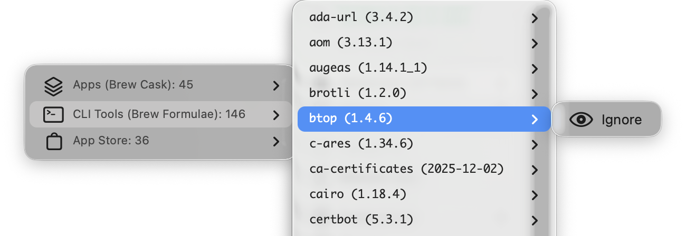
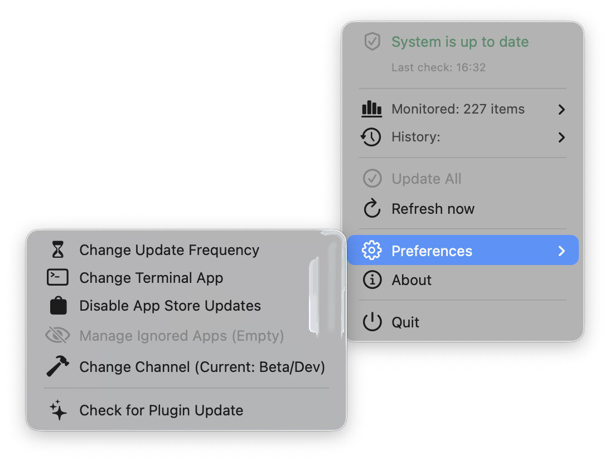

<div align="center" markdown="1">

[](LICENSE)
[](https://codeberg.org/pr-fuzzylogic/mac_software_updater/commits/branch/main)
[](https://codeberg.org/pr-fuzzylogic/mac_software_updater/releases)


</div>


# macOS Software Update & Migration Toolkit 

Mac Software Updater is a targeted automation tool designed to bring order to your macOS environment. This project combines **Homebrew**, **Mac App Store CLI (mas)**, and **SwiftBar** to solve two specific problems:
1.  **Migration:** Moving manually installed applications under the control of package managers (App Store or Homebrew).
2.  **Updates:** Monitors updates from the menu bar and applies them via a single terminal command.


## 🚀 Key Features

* **Fail-Safe Migration:** Safely converts "Drag & Drop" apps to Homebrew Casks or App Store versions without data loss.
* **Menu Bar Dashboard:** Detailed breakdown of Casks, Formulae, and Store apps (with version numbers).
* **One-Click Update:** Runs `brew upgrade` and `mas upgrade` in a terminal window with a single click.
* **Built-in Uninstaller:** A dedicated script to safely remove the toolkit and its logs.
* **Smart History:** Tracks how many updates you've installed over the last 7 and 30 days.
* **Apple Silicon Ready:** Works natively on M1/M2/M3 and Intel Macs.
* **Resilient Updates:** Features a smart failover system that automatically switches to a backup server (Codeberg) if GitHub is unreachable.

## ⚙️ How It Works

This is not a generic maintenance utility. It is a set of two scripts performing specific tasks:

### 1. Migration Wizard (`setup_mac.sh`)
Run via terminal, this script scans your `/Applications` folder to detect unmanaged software. For every app found, it checks if a matching version exists in Homebrew or the App Store.

* **Installation:** It can reuse your Homebrew and other tools, but if you don't have them, they will be installed
* **Verification:** Distinguishes between System apps, Homebrew apps, and manually downloaded apps. It will only migrate unmanaged versions
* **The Decision:** For every "unmanaged" app (e.g., Spotify or Chrome installed manually), it asks you for an action (depending on availability):
    * **[A]pp Store:** Replaces the manual version with the official App Store version.
    * **[B]rew Cask:** Replaces the manual version with a Homebrew Cask (preserving settings).
    * **[L]eave:** Keeps the app exactly as it is.
* **🛡️Safety First:** Before any migration, it creates a local backup (`.app.bak`). If the new installation fails (network error, hash mismatch) it automatically restores the original application. Only removes the backup if the installation was 100% successful.


### 2. Menu Bar Monitor (`update_system.x.sh`)
A lightweight plugin for **SwiftBar**.
* **Status:** A discreet icon in the menu bar displays the total count of available updates (combining Homebrew & App Store) or information that everything is updated
* **Action:** Clicking "Update All" launches a terminal window to run `brew upgrade` and `mas upgrade`, followed by a system cleanup.


## 📸 Screenshots

<table width="100%">
  <tr>
    <td width="50%" align="center"><b>Main Menu Status</b><br>Overview of Homebrew and App Store updates</td>
    <td width="50%" align="center"><b>History</b><br>Submenu tracking update counts for the last 7 and 30 days</td>
  </tr>
  <tr>
    <td valign="top" align="center">
      
    </td>
    <td valign="top" align="center">
      
    </td>
  </tr>
  <tr>
    <td width="50%" align="center"><b>Monitored apps</b><br>Submenu showing numbers of monitored apps</td>
    <td width="50%" align="center"><b>Managed Apps List</b><br>Submenu showing details of monitored apps</td>
  </tr>
  <tr>
    <td valign="top" align="center">
      
    </td>
    <td valign="top" align="center">
      
    </td>
  </tr>
  <tr>
    <td width="50%" align="center"><b>Preferences</b><br>Change Update Frequency, disable or force</td>
    <td width="50%" align="center"><b>Migration tool</b><br>CLI Tool</td>
  </tr>
  <tr>
    <td valign="top" align="center">
      
    </td>
    <td valign="top" align="center">
      
    </td>
  </tr>
</table>


### Menu Bar States

| Status | Icon Appearance | Description |
| :--- | :--- | :--- |
| **Up to Date** |  | System is clean, checkmark icon displayed. |
| **Updates Ready** |  | Badge with update count and red sync icon. |
| **Plugin Update** |  | New version of the toolkit is available. |


### Preferences & Control
Manage the plugin behavior directly from the menu.

| Feature | Description |
| :--- | :--- |
| **Update Frequency** | Toggle check intervals: `1h`, `2h`, `6h`, `12h`, or `1d`. |
| **Terminal App** | Choose preferred terminal: `Terminal`, `iTerm2`, `Warp`, or `Alacritty`. |
| **Self-Update** | Check for updates. The plugin will scan GitHub and Codeberg for its own new versions. |


## 🛠 Quick Start

### 1. Run the Installer
The fastest way to start is to run this command in your Terminal. It downloads and triggers the migration wizard:

**Option A: Standard Install (GitHub)**
```bash
curl -L https://github.com/pr-fuzzylogic/mac_software_updater/releases/download/v1.3.4/Installer.zip -o Installer.zip && unzip -q Installer.zip && cd mac_software_updater && chmod +x setup_mac.sh && ./setup_mac.sh
```

**Option B: Emergency Mirror (Codeberg)**
```bash
zsh -c "$(curl -fsSL https://codeberg.org/pr-fuzzylogic/mac_software_updater/raw/branch/main/setup_mac.sh)"
```

### 2. Follow the Wizard
The script will prompt you on how to handle detected applications. You can choose to migrate them or skip the process entirely.

### 3. Finish
Once completed, **SwiftBar** will launch automatically with the update monitor loaded.

> **Important:** If macOS asks for permission to access your Documents folder, click **Allow**. This is required for SwiftBar to write and read the plugin file.

---

## 📦 Tools Used

This toolkit acts as the "glue" integrating standard macOS power-user tools:

* **[Homebrew](https://brew.sh)** – The primary package manager. Used to install and update the majority of applications.
* **[mas-cli](https://github.com/mas-cli/mas)** – Command-line interface for the Mac App Store. Allows updating Store apps without opening the GUI.
* **[SwiftBar](https://swiftbar.app)** – Open-source app that runs the monitor script and displays the output in the macOS menu bar.

---

## 🗑️ Uninstallation

If you decide to remove the toolkit, an uninstaller script is automatically placed in your application support folder during setup.

To uninstall:
1. Open **Terminal**.
2. Run the following command:

```zsh
~/Library/Application\ Support/MacSoftwareUpdater/uninstall.sh
```

---

## 📝 Notes
> **Important:** Since this script uses checksums to detect updates, modifying the code (e.g., changing icons) will trigger a "Plugin Update Available" alert. If you customize the script, please go to Preferences → Disable Self-Update to prevent your changes from being overwritten.
> **Limitation:** Apple-native apps (e.g., iMovie) are often invisible to the mas CLI. While this plugin provides a workaround to monitor these "Ghost Apps," the actual update must be performed manually in the App Store.
> **Known Issue:** Apps running as iPad/iPhone wrappers on Apple Silicon are invisible to this tool. This is a limitation of the upstream `mas` command-line utility used for App Store interactions.

## License

MIT License.
