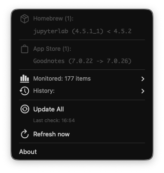
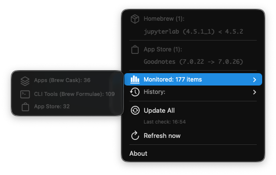

# macOS Software Update & Migration Toolkit 

A targeted automation tool designed to bring order to your macOS environment. This project combines **Homebrew**, **Mac App Store CLI (mas)**, and **SwiftBar** to solve two specific problems:
1.  **Migration:** Moving manually installed applications under the control of package managers (App Store or Homebrew).
2.  **Updates:** Monitoring available updates from the menu bar and installing them in bulk via the terminal.

## 🚀 How It Works

This is not a generic maintenance utility. It is a set of two scripts performing specific tasks:

### 1. Migration Wizard (`setup_mac.sh`)
Run via terminal, this script scans your `/Applications` folder to detect unmanaged software. For every app found, it checks if a matching version exists in Homebrew or the App Store.

* **The Audit:** Distinguishes between System apps, Homebrew apps, and manually downloaded apps.
* **The Decision:** For every "unmanaged" app (e.g., Spotify or Chrome installed manually), it asks you for an action:
    * **[A]pp Store:** Replaces the manual version with the official App Store version.
    * **[B]rew Cask:** Replaces the manual version with a Homebrew Cask (preserving settings).
    * **[L]eave:** Keeps the app exactly as it is.
* **Safety First:** Before any migration, it creates a local backup (`.app.bak`). If the new installation fails, it automatically restores the original application.

### 2. Menu Bar Monitor (`update_system.1h.sh`)
A lightweight plugin for **SwiftBar**.
* **Status:** A discreet icon in the menu bar displays the total count of available updates (combining Homebrew & App Store).
* **Action:** Clicking "Update All" launches a terminal window to run `brew upgrade` and `mas upgrade`, followed by a system cleanup.


## Screenshots

### Menu Bar States
| Status | Icon Appearance | Description |
| :--- | :--- | :--- |
| **Up to Date** |  | System is clean, checkmark icon displayed. |
| **Updates Ready** |  | Badge with update count and red sync icon. |

### Dropdown Interface
| Category | Screenshot | Features |
| :--- | :--- | :--- |
| **Main View** |  | Overview of Homebrew and App Store updates. |
| **Statistics** |  | Submenu showing counts for Casks, Formulae, and MAS apps. |
| **History** |  | Submenu tracking update counts for the last 7 and 30 days. |
---

## 📋 Prerequisites

* **macOS** (Intel or Apple Silicon).
* Internet Connection.
* No prior installation of Homebrew is required – the script handles the setup.

---

## 🛠 Quick Start

### 1. Run the Installer
The fastest way to start is to run this command in your Terminal. It downloads and triggers the migration wizard:

```bash
curl -L https://github.com/pr-fuzzylogic/mac_software_updater/releases/download/v1.0.0/Installer.zip -o Installer.zip && unzip -q Installer.zip && cd mac_software_updater && chmod +x setup_mac.sh && ./setup_mac.sh
```
### 2. Follow the Wizard
The script will prompt you on how to handle detected applications. You can choose to migrate them or skip the process entirely.

### 3. Finish
Once completed, **SwiftBar** will launch automatically with the update monitor loaded.

> **Important:** If macOS asks for permission to access your Documents folder, click **Allow**. This is required for SwiftBar to write and read the plugin file.

---

## 📦 Tools Used

This toolkit acts as the "glue" integrating standard macOS power-user tools:

* **[Homebrew](https://brew.sh)** – The primary package manager. Used to install and update the majority of applications.
* **[mas-cli](https://github.com/mas-cli/mas)** – Command-line interface for the Mac App Store. Allows updating Store apps without opening the GUI.
* **[SwiftBar](https://swiftbar.app)** – Open-source app that runs the monitor script and displays the output in the macOS menu bar.
* **[SF Symbols](https://developer.apple.com/sf-symbols/)** (Optional) – Apple's icon library. The installer will ask if you want to download it. It is **only** needed if you plan to manually customize the icons in the script code. The default icons work without it.

---

### 🎨 How to Customize Icons
If you want to change the icons displayed in your menu bar, follow these steps:
1. Open the **SF Symbols** app to find a symbol you like (e.g., `gear`, `bolt.fill`).
2. Right-click the symbol and select **Copy Name**.
3. Open `update_system.1h.sh` in a text editor.
4. Find the line starting with `echo "$total | sfimage=..."`.
5. Replace the value after `sfimage=` with your copied name.
6. Save the file and SwiftBar will update automatically.

## License

MIT License.